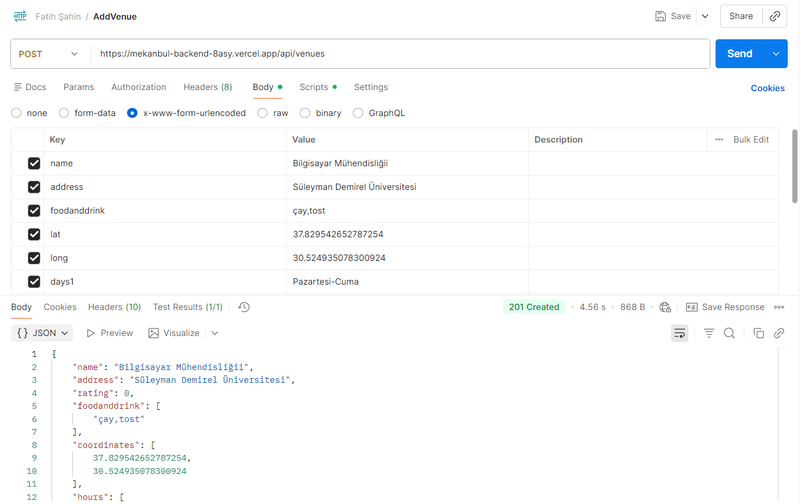
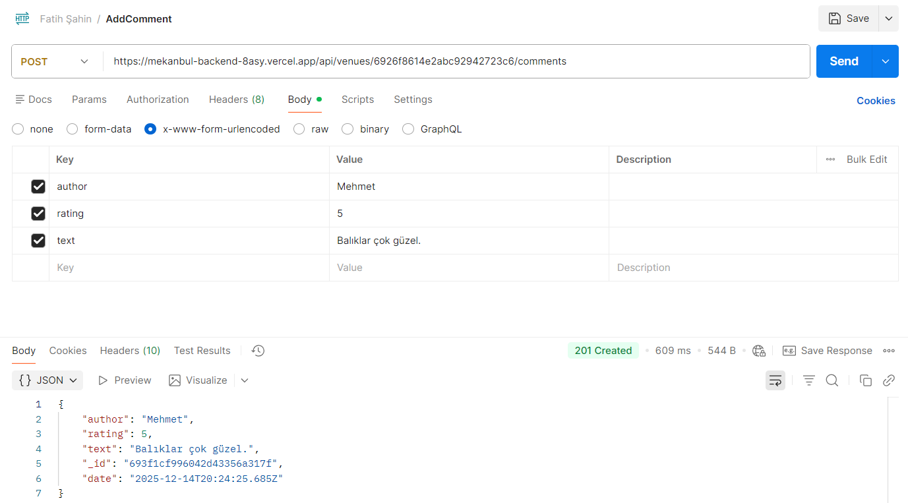
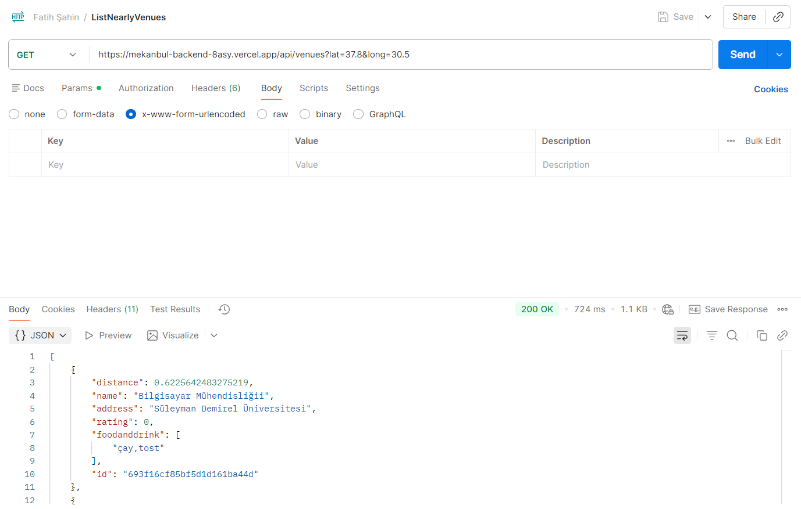
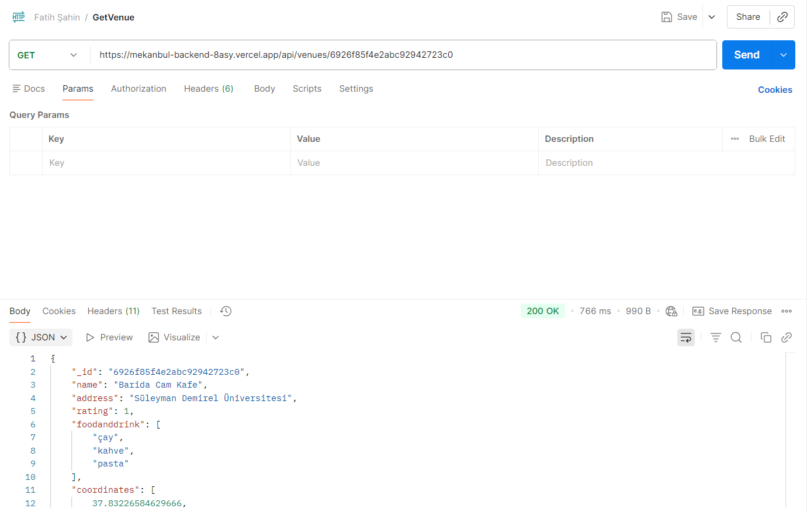
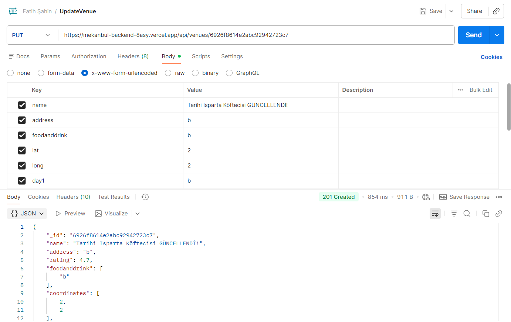
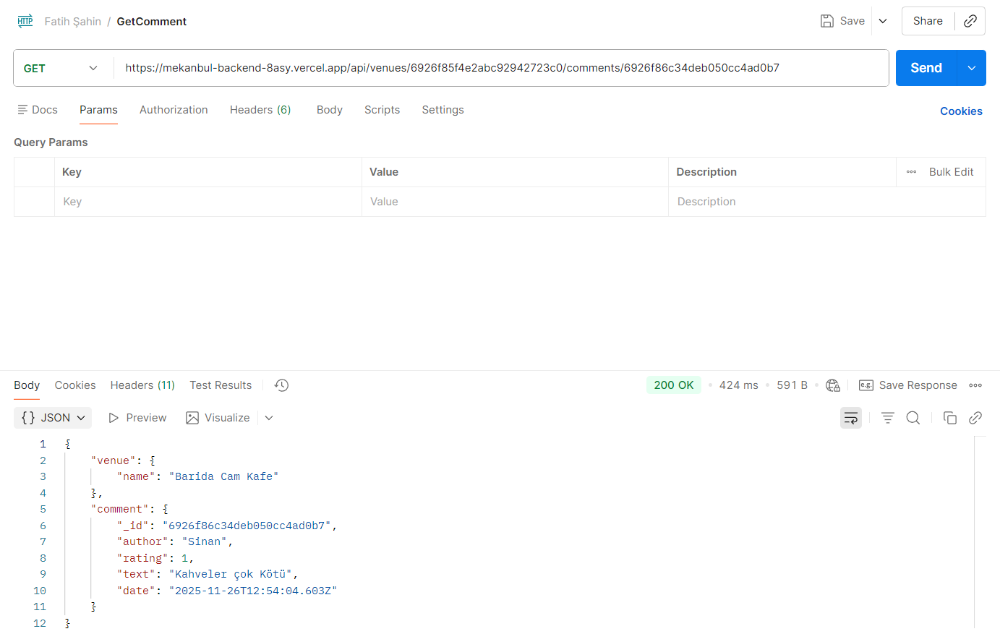
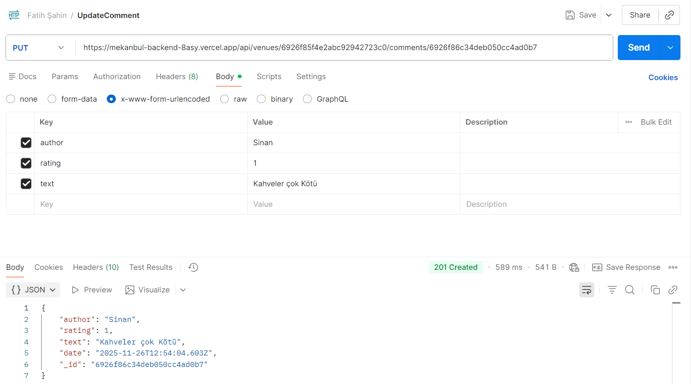
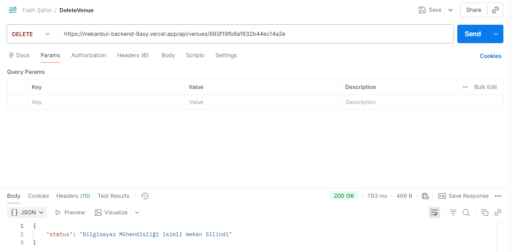

# 📌 MEKANBUL-BACKEND

Bu repo **mekanbul-backend** uygulamasının basit Node.js + Express + Mongoose backend'idir. Uygulama, mekan (venue) verilerini MongoDB Cloud üzerinde tutar ve REST API üzerinden listeler, ekler, günceller ve siler.

---

## 🌍 Vercel Adresi

[API'yi görmek için buraya tıkla](https://mekanbul-backend-8asy.vercel.app)

---

## 📖 Kısa Açıklama

- API, mekan (venue) verilerini yönetir: listeleme, ekleme, görüntüleme, güncelleme, silme.
- MongoDB Cloud kullanır.
- Bağlantı bilgisi `.env` dosyasındaki `MONGODB_URI` değişkeninden gelir.
- (Bakınız: `app_api/models/db.js`)

---

## 🚀 Kurulum

Projeyi klonladıktan sonra bağımlılıkları yükleyin:

```bash
cd /path/to/backend
npm install
```

`.env` dosyasını oluşturun ve MongoDB bağlantı bilgilerinizi ekleyin:

```
MONGODB_URI=your_mongodb_connection_string
PORT=3000
```

---

## ▶️ Uygulamayı Çalıştırma

```bash
npm start
```

Uygulama varsayılan olarak `http://localhost:3000` adresinde çalışacaktır.


## 🧪 Postman Test Sonuçları

Aşağıda Postman ile alınmış test sonuçlarının ekran görüntüleri bulunmaktadır.

### Add Venue (POST)


### Add Comment (POST)


### List Nearly Venues (GET)


### Get Venue (GET)


### Update Venue (PUT)


### Get Comment (GET)


### Update Comment (PUT)


### Delete Comment (DELETE)


### Delete Venue (DELETE)


---

## 📁 Postman Koleksiyonu

Tüm API istekleri aşağıdaki koleksiyon içine eklenmiştir:

```
Fatih Şahin.postman_collection.json
```

Bu dosya proje klasörünün içindedir ve Postman'e **Import** edilerek kullanılabilir.

---

## 📂 Proje Klasör Yapısı

```
BACKEND/
├── app_api/
│   ├── controllers/
│   │   ├── CommentController.js
│   │   └── VenueController.js
│   ├── models/
│   │   ├── db.js
│   │   └── venue.js
│   └── routes/
│       └── index.js
├── bin/
├── node_modules/
├── public/
├── routes/
├── tests/
│   ├── Add_Comment.png
│   ├── Add_Venue.png
│   ├── Delete_Comment.png
│   ├── Delete_Venue.png
│   ├── Get_Comment.png
│   ├── Get_Venue.png
│   ├── List_Nearly_Venues.png
│   ├── Update_Comment.png
│   └── Update_Venue.png
├── .gitignore
├── app.js
├── insert.mongodb
├── package-lock.json
├── package.json
├── README.md
├── Fatih Şahin.postman_collection.json
└── update.mongodb
```

---

## 🛠️ Kullanılan Teknolojiler

- **Node.js** - JavaScript runtime
- **Express.js** - Web framework
- **MongoDB** - NoSQL veritabanı
- **Mongoose** - MongoDB ODM
- **Vercel** - Deployment platformu